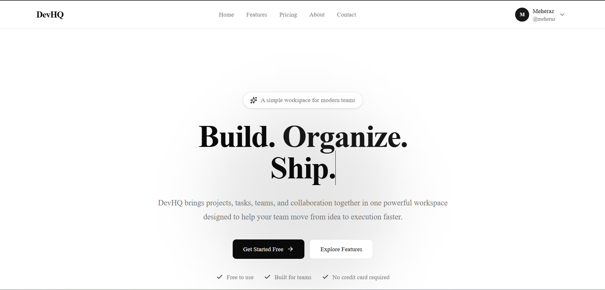
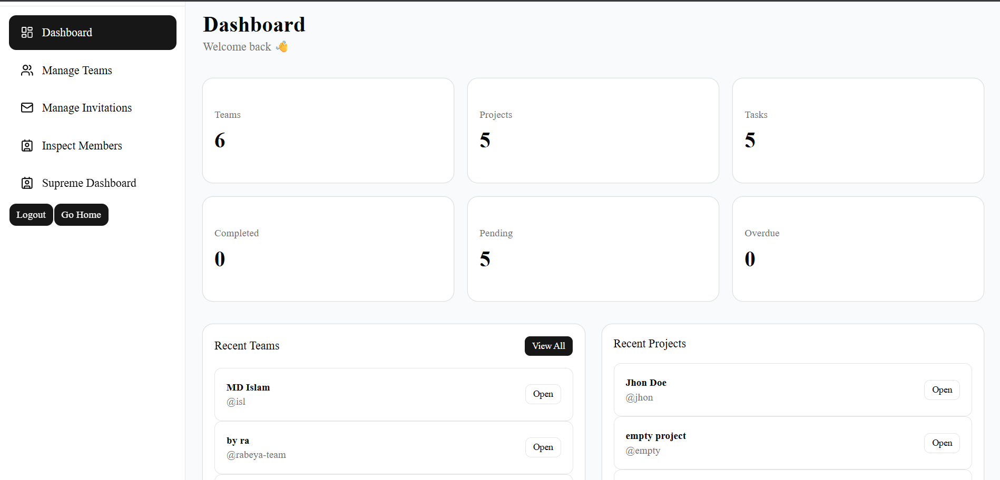
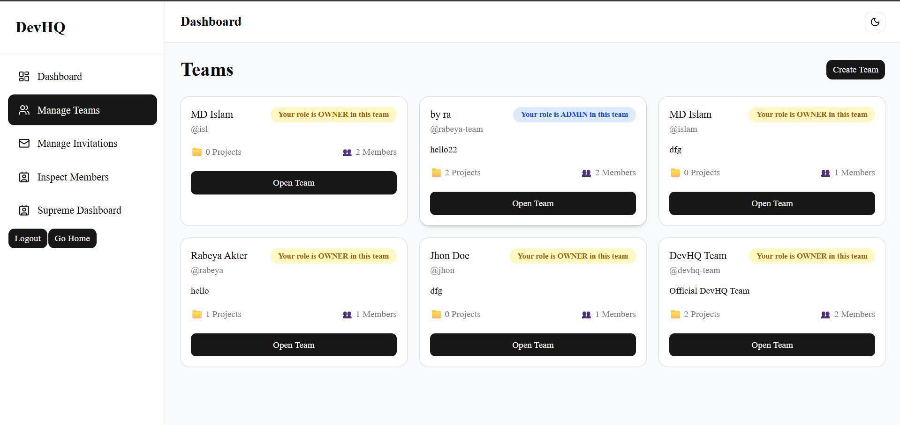
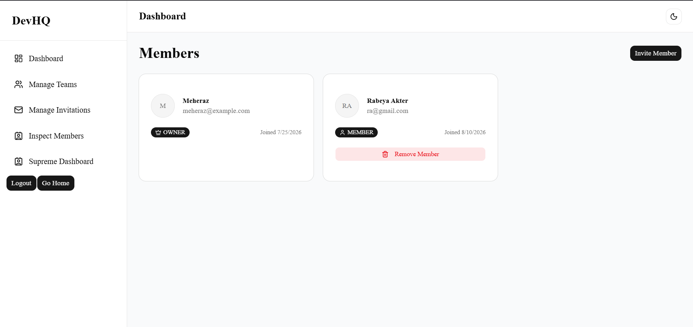
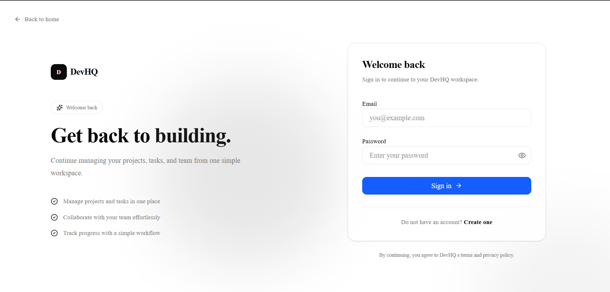
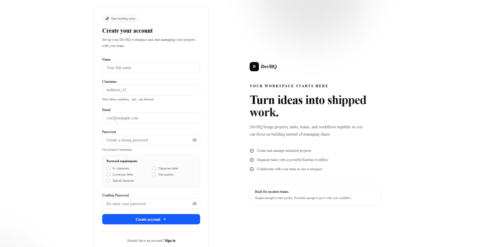

# 🚀 DevHQ

### Modern Team & Project Management for Developers

DevHQ is a modern, full-stack SaaS platform designed to help development teams **organize projects, manage tasks, collaborate with team members, and track work efficiently** — all from one centralized workspace.

Built with a modern TypeScript stack, DevHQ combines a polished SaaS experience with a scalable backend architecture and production deployment.

<p align="center">
  <a href="https://dev-hq.vercel.app/">
    <strong>🌐 Live Demo</strong>
  </a>
  &nbsp;&nbsp;•&nbsp;&nbsp;
  <a href="https://github.com/meheraz1100/DevHQ-Client">
    <strong>💻 Frontend</strong>
  </a>
  &nbsp;&nbsp;•&nbsp;&nbsp;
  <a href="https://github.com/meheraz1100/DevHQ-Server">
    <strong>⚙️ Backend</strong>
  </a>
</p>

---

## ✨ Why DevHQ?

Managing development work across scattered tools can quickly become complicated.

DevHQ brings the essential workflow into one place:

```text
👥 Teams
   ↓
📁 Projects
   ↓
📋 Kanban Boards
   ↓
✅ Tasks
   ↓
🤝 Collaboration
   ↓
📊 Project Progress
```

The goal is simple:

> **Give development teams a focused workspace where planning, execution, and collaboration happen together.**

---

## 🎯 Core Features

### 🔐 Authentication & Authorization

* Secure user authentication
* JWT-based access-token authentication
* Refresh-token based session management
* Persistent authentication state
* Protected application routes
* Role-aware access control
* Secure logout flow

### 👥 Team Management

* Create and manage teams
* Team member management
* Role-based team permissions
* Owner / Admin / Member roles
* Team invitations
* Invitation acceptance and decline flows

### 📁 Project Management

* Create projects within teams
* Update project information
* Delete projects
* Project-specific workspaces
* Team-based project organization

### 📋 Kanban Task Management

DevHQ provides a visual workflow for managing development tasks.

```text
┌─────────────┐
│   TODO      │
└──────┬──────┘
       │
       ▼
┌─────────────┐
│ IN PROGRESS │
└──────┬──────┘
       │
       ▼
┌─────────────┐
│   REVIEW    │
└──────┬──────┘
       │
       ▼
┌─────────────┐
│    DONE     │
└─────────────┘
```

Features include:

* Task creation
* Task editing
* Task deletion
* Task priorities
* Task descriptions
* Due dates
* Assignees
* Task movement between columns
* Drag-and-drop Kanban workflow

### 📩 Invitations

Team collaboration is supported through an invitation workflow:

```text
Owner/Admin
     │
     ▼
Create Invitation
     │
     ▼
Invitation Token
     │
     ▼
Invited User
     │
 ┌───┴────┐
 ▼        ▼
Accept   Decline
```

### 🛡️ Supreme Admin

DevHQ also includes a dedicated **Supreme Admin** area designed for developer-level system monitoring.

The concept is to provide centralized visibility over:

* Users
* Teams
* Projects
* Roles
* Administrative data
* Platform-level information

This area is intentionally separated from normal user/admin functionality.

---

# 🧩 Tech Stack

## Frontend

<p align="left">
  
  
  
  
  
  
  
  
  
  
  
  
  
</p>

| Technology | Purpose |
| --- | --- |
| **Next.js 16** | React framework & application routing |
| **React** | UI development |
| **TypeScript** | Type-safe development |
| **Tailwind CSS** | Styling |
| **shadcn/ui** | UI components |
| **TanStack Query** | Server-state management |
| **Zustand** | Client-side authentication state |
| **React Hook Form** | Form management |
| **Zod** | Form validation |
| **Axios** | HTTP client |
| **dnd-kit** | Drag-and-drop Kanban interactions |
| **Sonner** | Toast notifications |
| **Lucide React** | UI icons |

---

## Backend

<p align="left">
  
  
  
  
  
  
  
  
  
</p>

| Technology | Purpose |
| --- | --- |
| **Node.js** | JavaScript runtime |
| **Express.js** | REST API development |
| **TypeScript** | Type-safe backend development |
| **Prisma ORM** | Database access & migrations |
| **PostgreSQL** | Relational database |
| **JWT** | Access-token authentication |
| **Zod** | Request validation |
| **bcrypt** | Password hashing & security |
| **CORS** | Cross-origin API access |

---

## ☁️ Deployment & Infrastructure

<p align="left">
  
  
  
</p>

| Technology | Purpose |
| --- | --- |
| **Vercel** | Frontend deployment |
| **Render** | Backend/API deployment |
| **PostgreSQL** | Production database |

---

# 🏗️ Architecture

DevHQ follows a clean separation between the frontend application, REST API, and database.

```text
                    ┌──────────────────────┐
                    │      DevHQ Web       │
                    │      Next.js 16      │
                    └──────────┬───────────┘
                               │
                               │ HTTPS / REST API
                               ▼
                    ┌──────────────────────┐
                    │      DevHQ API       │
                    │ Node.js + Express    │
                    └──────────┬───────────┘
                               │
                         Prisma ORM
                               │
                               ▼
                    ┌──────────────────────┐
                    │     PostgreSQL       │
                    │      Database        │
                    └──────────────────────┘
```

### Authentication Flow

```text
User
 │
 │ Login
 ▼
Next.js Client
 │
 │ POST /auth/login
 ▼
Express API
 │
 ├── Validate credentials
 │
 ├── Generate access token
 │
 └── Generate refresh token
 │
 ▼
Authenticated Session
 │
 ├── Access Token → Client State
 │
 └── Refresh Token → Secure Cookie
```

When an access token expires:

```text
API Request
    │
    ▼
   401
    │
    ▼
Refresh Token
    │
    ▼
New Access Token
    │
    ▼
Retry Original Request
```

This keeps the user experience persistent while separating short-lived API authorization from long-lived session management.

---

# 📂 Repository Structure

DevHQ is split into two repositories.

### Frontend

```text
DevHQ-Client/
│
├── src/
│   ├── app/
│   │   ├── (auth)/
│   │   ├── (dashboard)/
│   │   ├── about/
│   │   ├── contact/
│   │   ├── features/
│   │   └── pricing/
│   │
│   ├── components/
│   ├── hooks/
│   ├── lib/
│   ├── services/
│   ├── store/
│   ├── types/
│   └── validators/
│
├── public/
├── package.json
└── ...
```

### Backend

```text
DevHQ-Server/
│
├── src/
│   ├── middlewares/
│   ├── modules/
│   │   ├── auth/
│   │   ├── board/
│   │   ├── project/
│   │   ├── task/
│   │   ├── task-column/
│   │   └── team/
│   │
│   ├── routes/
│   ├── utils/
│   └── server.ts
│
├── prisma/
│   └── schema.prisma
│
├── package.json
└── ...
```

This modular structure makes it easier to maintain and extend individual domains without turning the backend into a monolithic controller/service layer.

---

# 🖥️ Product Experience

DevHQ includes a public-facing SaaS experience alongside the authenticated application.

### Public Pages

* Home
* Features
* Pricing
* About
* Contact

### Application Pages

* Dashboard
* Teams
* Team details
* Team members
* Projects
* Project workspace
* Kanban board
* Invitations
* Supreme Admin
* Authentication

---

# 📸 Screenshots

### Landing Page



### Dashboard



### Team Management



### Member Board



### Authentication




---

# ⚙️ Local Development

## 1. Clone the repositories

### Frontend

```bash
git clone https://github.com/meheraz1100/DevHQ-Client.git
cd DevHQ-Client
```

### Backend

```bash
git clone https://github.com/meheraz1100/DevHQ-Server.git
cd DevHQ-Server
```

---

## 2. Install dependencies

```bash
npm install
```

---

## 3. Configure environment variables

### Frontend

Create:

```text
.env.local
```

Example:

```env
NEXT_PUBLIC_API_URL=http://localhost:5000/api/v1
```

### Backend

Create:

```text
.env
```

Example:

```env
DATABASE_URL=your_database_url

PORT=5000

JWT_ACCESS_SECRET=your_access_secret
JWT_REFRESH_SECRET=your_refresh_secret

CLIENT_URL=http://localhost:3000
```

Use your actual environment variables and secrets rather than committing `.env` files to Git.

---

## 4. Setup Prisma

```bash
npx prisma generate
```

If you're setting up the database from migrations:

```bash
npx prisma migrate dev
```

---

## 5. Start the backend

```bash
npm run dev
```

The API will be available at:

```text
http://localhost:5000
```

---

## 6. Start the frontend

```bash
npm run dev
```

Open:

```text
http://localhost:3000
```

---

# 🌐 Production

### Frontend

[DevHQ Live Application](https://dev-hq.vercel.app/)

### Backend

[DevHQ Production API](https://devhq-server.onrender.com/api/v1)

### Source Code

[DevHQ Client — GitHub](https://github.com/meheraz1100/DevHQ-Client)

[DevHQ Server — GitHub](https://github.com/meheraz1100/DevHQ-Server)

---

# 🚀 Deployment Architecture

DevHQ is deployed using a decoupled production architecture:

```text
                    INTERNET
                       │
          ┌────────────┴────────────┐
          │                         │
          ▼                         ▼
 ┌─────────────────┐      ┌─────────────────┐
 │     Vercel      │      │     Render      │
 │                 │      │                 │
 │ Next.js Client  │─────▶│ Express Server  │
 │                 │ HTTPS│                 │
 └─────────────────┘      └────────┬────────┘
                                   │
                                   ▼
                           ┌───────────────┐
                           │  PostgreSQL   │
                           └───────────────┘
```

This separation allows the frontend and backend to be independently deployed and scaled.

---

# 🔒 Security Considerations

DevHQ was built with several production-oriented security practices:

* Password hashing
* JWT-based authentication
* Short-lived access tokens
* Refresh-token based sessions
* HTTP credentials for authenticated API requests
* Protected API endpoints
* Role-based authorization
* Request validation
* CORS configuration
* Environment-based secrets
* Separation between public and authenticated application areas

> Production credentials and secrets are never intended to be committed to source control.

---

# 🧠 Engineering Highlights

DevHQ was built to demonstrate practical full-stack engineering rather than simply CRUD functionality.

### Frontend Engineering

* Next.js App Router
* Server/client component separation
* Type-safe forms
* Centralized API services
* React Query server-state management
* Zustand authentication persistence
* Reusable UI components
* Responsive SaaS layouts
* Drag-and-drop interactions

### Backend Engineering

* Modular Express architecture
* Controller → Service separation
* Prisma data layer
* Request validation
* Authentication middleware
* Authorization logic
* Centralized error handling
* Async request handling
* RESTful API design

### Production Engineering

* Separate frontend/backend deployments
* Environment-based configuration
* Production CORS configuration
* TypeScript build validation
* Prisma client generation during deployment
* Production authentication/session handling

---

# 🗺️ Roadmap

DevHQ is designed to evolve beyond its current feature set.

### Planned

* [ ] Real-time team collaboration
* [ ] Activity timeline
* [ ] Advanced project analytics
* [ ] Task comments
* [ ] File attachments
* [ ] Notifications
* [ ] Email notifications
* [ ] Advanced search
* [ ] Advanced filtering
* [ ] Project activity logs
* [ ] Dark mode improvements
* [ ] More granular permissions
* [ ] Automated testing
* [ ] CI/CD pipeline
* [ ] Improved observability and logging

---

# 🤝 Contributing

Contributions, ideas, and feedback are welcome.

```bash
# Fork the repository

# Create your feature branch
git checkout -b feature/amazing-feature

# Commit your changes
git commit -m "feat: add amazing feature"

# Push your branch
git push origin feature/amazing-feature

# Open a Pull Request
```

For larger changes, please open an issue first so the proposed direction can be discussed.

---

# 📄 License

This project is currently intended as a portfolio and learning project.

Add your preferred license here if you decide to open-source the project under a specific license.

---

# 👨‍💻 Author

## MD Mosaiyeb Islam Meheraz

Full-Stack Web Developer focused on building modern, scalable web applications with **React, Next.js, Node.js, Express, TypeScript, and PostgreSQL**.

DevHQ was built as a practical demonstration of:

> **Product thinking + modern frontend engineering + backend architecture + authentication + deployment.**

---

<p align="center">

### ⭐ If you found DevHQ interesting, consider giving the repository a star.

**Built with ❤️ and TypeScript**

</p>

---

### 🔗 DevHQ

**Live:** [dev-hq.vercel.app](https://dev-hq.vercel.app/?utm_source=chatgpt.com)
**Client:** [GitHub — DevHQ Client](https://github.com/meheraz1100/DevHQ-Client?utm_source=chatgpt.com)
**Server:** [GitHub — DevHQ Server](https://github.com/meheraz1100/DevHQ-Server?utm_source=chatgpt.com)
**API:** [devhq-server.onrender.com](https://devhq-server.onrender.com?utm_source=chatgpt.com)

**My recommendation:** put this README in the **frontend repository as the main product README**, and give the backend repository a shorter, engineering-focused README linking back to the main DevHQ product. That makes your GitHub profile look much more intentional to recruiters.
